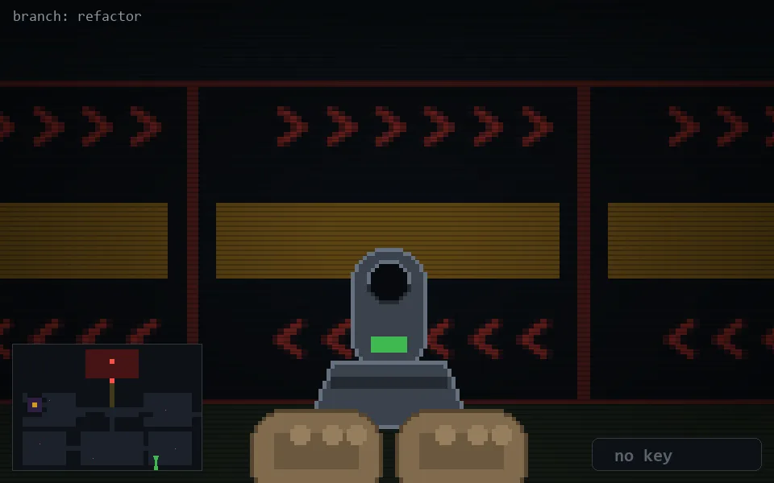

<!-- node:x29y23Sd -->
### `branch: refactor` · 📍 (29, 23) · facing S · 🔑 — · ✖ bug deleted (it will be back)

|      |      |      |
|:----:|:----:|:----:|
|      | [⬆️](x29y24Sd.md) |      |
| [⬅️](x29y23Ed.md) | [💥](x29y23Sd.md) | [➡️](x29y23Wd.md) |
|      | [⬇️](x29y22Sd.md) |      |

[⌂ index](../README.md)
