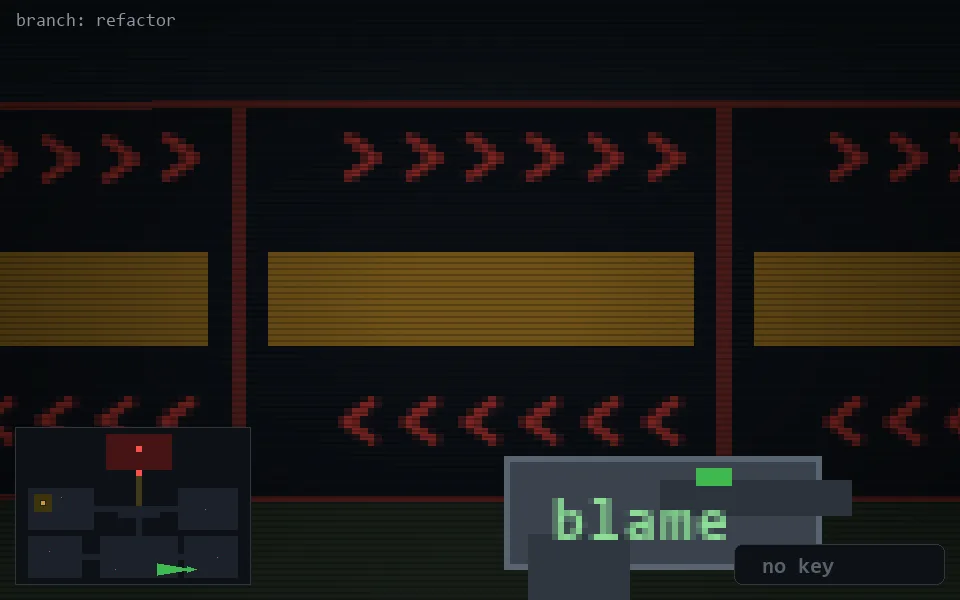

<!-- node:x29y23W -->
### `branch: refactor` · 📍 (29, 23) · facing W · 🔑 —

|      |      |      |
|:----:|:----:|:----:|
|      | [⬆️](x28y23W.md) |      |
| [⬅️](x29y23S.md) | [💥](x29y23Wd.md) | [➡️](x29y23N.md) |
|      | [⬇️](x30y23W.md) |      |

[⌂ index](../README.md)
