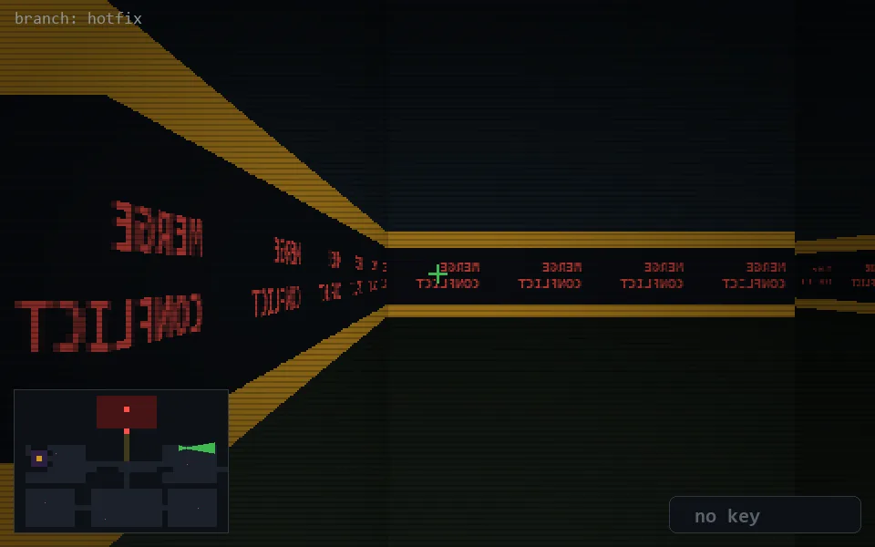

<!-- node:x30y10E -->
### `branch: hotfix` · 📍 (30, 10) · facing E · 🔑 —

|      |      |      |
|:----:|:----:|:----:|
|      | [⬆️](x31y10E.md) |      |
| [⬅️](x30y10N.md) | [💥](x30y10Ed.md) | [➡️](x30y10S.md) |
|      | [⬇️](x29y10E.md) |      |

[⌂ index](../README.md)
