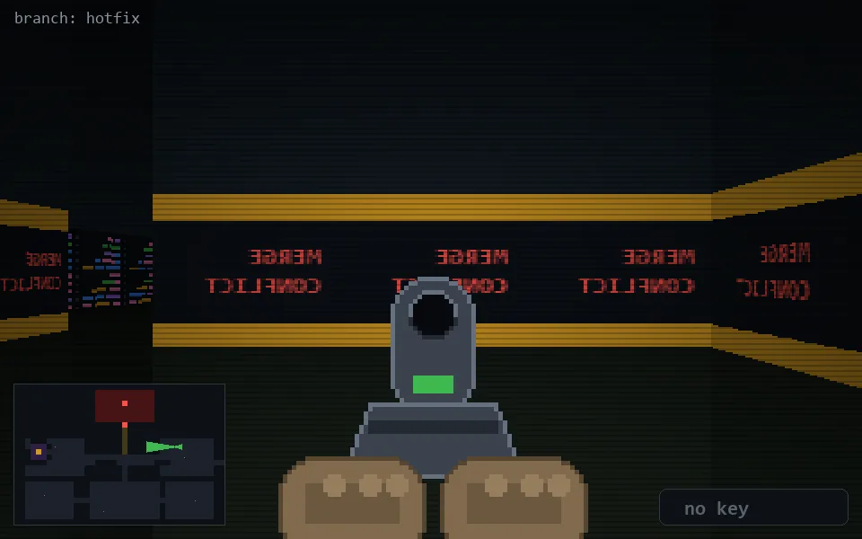

<!-- node:x30y11Wd -->
### `branch: hotfix` · 📍 (30, 11) · facing W · 🔑 — · ✖ bug deleted (it will be back)

|      |      |      |
|:----:|:----:|:----:|
|      | [⬆️](x29y11Wd.md) |      |
| [⬅️](x30y11Sd.md) | [💥](x30y11Wd.md) | [➡️](x30y11Nd.md) |
|      | [⬇️](x31y11Wd.md) |      |

[⌂ index](../README.md)
