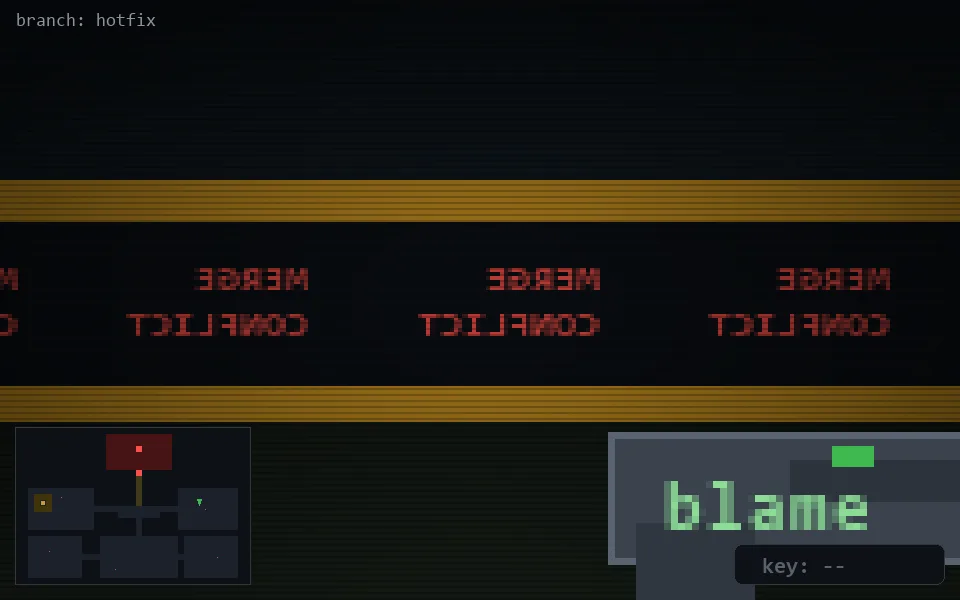

<!-- node:x30y12N -->
### `branch: hotfix` · 📍 (30, 12) · facing N · 🔑 —

|      |      |      |
|:----:|:----:|:----:|
|      | [⬆️](x30y11N.md) |      |
| [⬅️](x30y12W.md) | [💥](x30y12N.md) | [➡️](x30y12E.md) |
|      | [⬇️](x30y13N.md) |      |

[⌂ index](../README.md)
