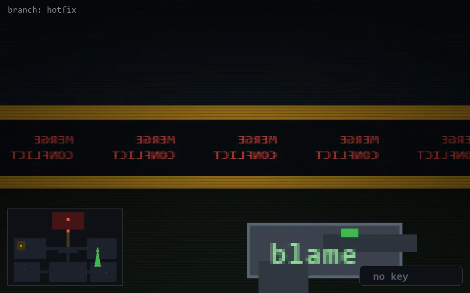

<!-- node:x30y13S -->
### `branch: hotfix` · 📍 (30, 13) · facing S · 🔑 —

|      |      |      |
|:----:|:----:|:----:|
|      | [⬆️](x30y14S.md) |      |
| [⬅️](x30y13E.md) | [💥](x30y13S.md) | [➡️](x30y13W.md) |
|      | [⬇️](x30y12S.md) |      |

[⌂ index](../README.md)
