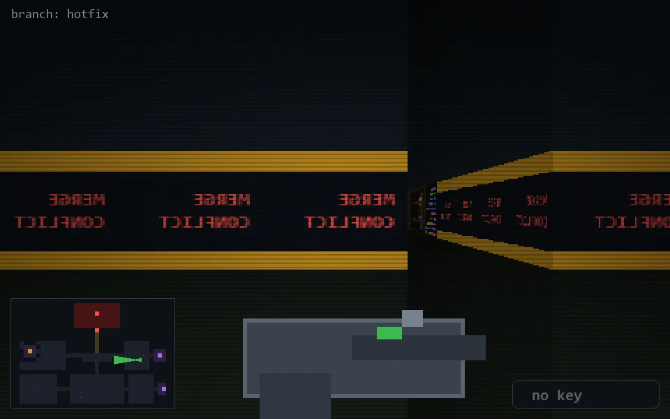

<!-- node:x30y14W -->
### `branch: hotfix` · 📍 (30, 14) · facing W · 🔑 —

|      |      |      |
|:----:|:----:|:----:|
|      | [⬆️](x29y14W.md) |      |
| [⬅️](x30y14S.md) | [💥](x30y14Wd.md) | [➡️](x30y14N.md) |
|      | [⬇️](x31y14W.md) |      |

[⌂ index](../README.md)
