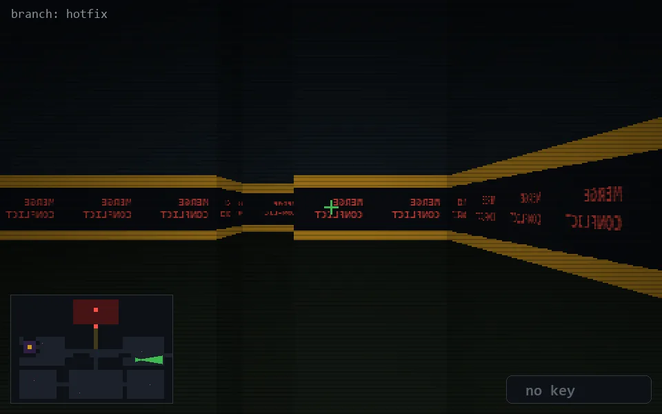

<!-- node:x30y15E -->
### `branch: hotfix` · 📍 (30, 15) · facing E · 🔑 —

|      |      |      |
|:----:|:----:|:----:|
|      | [⬆️](x31y15E.md) |      |
| [⬅️](x30y15N.md) | [💥](x30y15E.md) | [➡️](x30y15S.md) |
|      | [⬇️](x29y15E.md) |      |

[⌂ index](../README.md)
