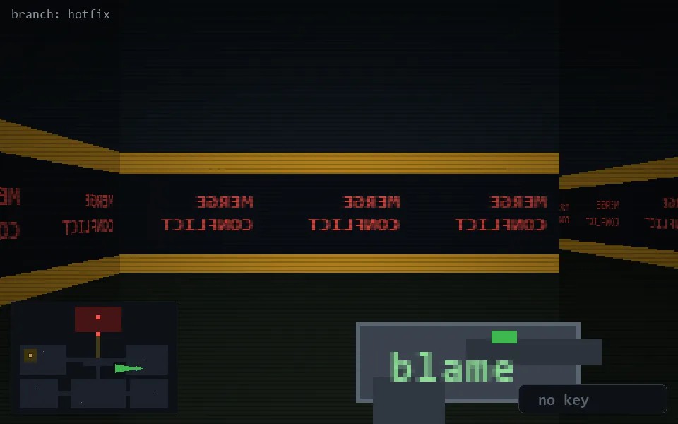

<!-- node:x30y15W -->
### `branch: hotfix` · 📍 (30, 15) · facing W · 🔑 —

|      |      |      |
|:----:|:----:|:----:|
|      | [⬆️](x29y15W.md) |      |
| [⬅️](x30y15S.md) | [💥](x30y15W.md) | [➡️](x30y15N.md) |
|      | [⬇️](x31y15W.md) |      |

[⌂ index](../README.md)
