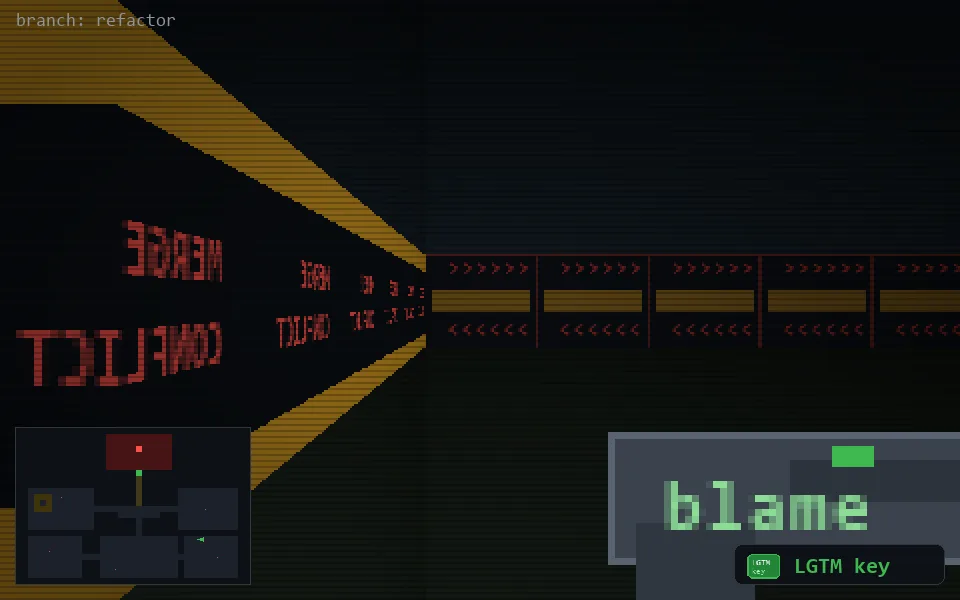

<!-- node:x30y18Ek -->
### `branch: refactor` · 📍 (30, 18) · facing E · 🔑 THE KEY

|      |      |      |
|:----:|:----:|:----:|
|      | [⬆️](x31y18Ek.md) |      |
| [⬅️](x30y18Nk.md) | [💥](x30y18Ekd.md) | [➡️](x30y18Sk.md) |
|      | [⬇️](x29y18Ek.md) |      |

[⌂ index](../README.md)
