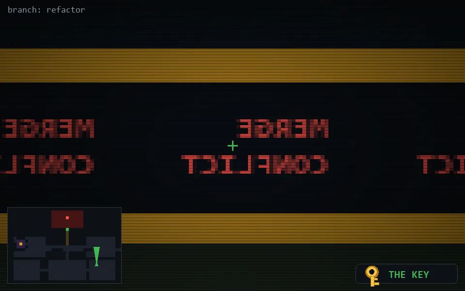

<!-- node:x30y19Nkd -->
### `branch: refactor` · 📍 (30, 19) · facing N · 🔑 THE KEY · ✖ bug deleted (it will be back)

|      |      |      |
|:----:|:----:|:----:|
|      | [⬆️](x30y18Nkd.md) |      |
| [⬅️](x30y19Wkd.md) | [💥](x30y19Nkd.md) | [➡️](x30y19Ekd.md) |
|      | [⬇️](x30y20Nkd.md) |      |

[⌂ index](../README.md)
