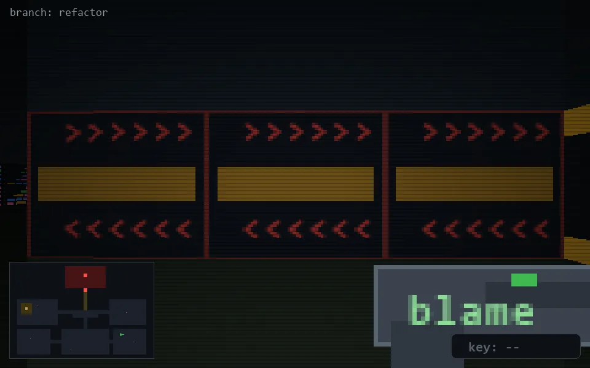

<!-- node:x30y19W -->
### `branch: refactor` · 📍 (30, 19) · facing W · 🔑 —

|      |      |      |
|:----:|:----:|:----:|
|      | [⬆️](x29y19W.md) |      |
| [⬅️](x30y19S.md) | [💥](x30y19W.md) | [➡️](x30y19N.md) |
|      | [⬇️](x31y19W.md) |      |

[⌂ index](../README.md)
