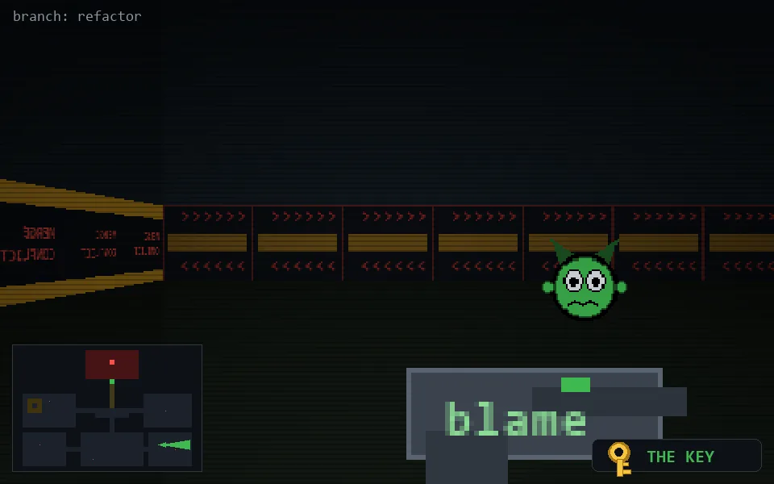

<!-- node:x30y20Ek -->
### `branch: refactor` · 📍 (30, 20) · facing E · 🔑 LGTM

|      |      |      |
|:----:|:----:|:----:|
|      | [⬆️](x31y20Ek.md) |      |
| [⬅️](x30y20Nk.md) | [💥](x30y20Ek.md) | [➡️](x30y20Sk.md) |
|      | [⬇️](x29y20Ek.md) |      |

[⌂ index](../README.md)
