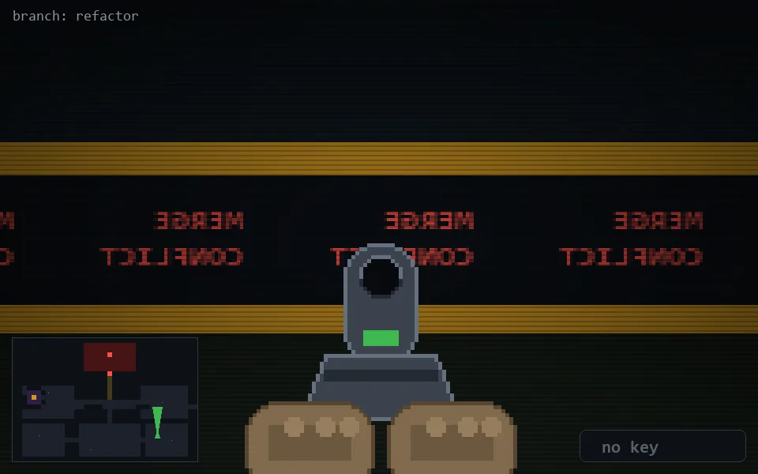

<!-- node:x30y20Nd -->
### `branch: refactor` · 📍 (30, 20) · facing N · 🔑 — · ✖ bug deleted (it will be back)

|      |      |      |
|:----:|:----:|:----:|
|      | [⬆️](x30y19Nd.md) |      |
| [⬅️](x30y20Wd.md) | [💥](x30y20Nd.md) | [➡️](x30y20Ed.md) |
|      | [⬇️](x30y21Nd.md) |      |

[⌂ index](../README.md)
