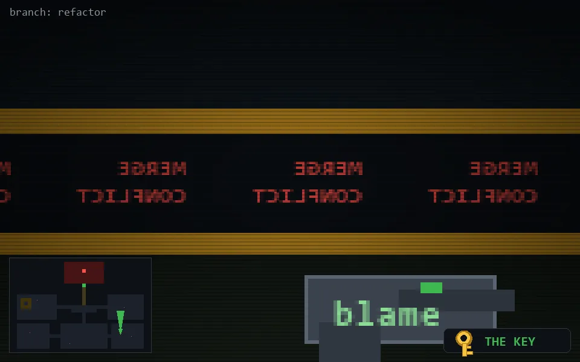

<!-- node:x30y20Nk -->
### `branch: refactor` · 📍 (30, 20) · facing N · 🔑 THE KEY

|      |      |      |
|:----:|:----:|:----:|
|      | [⬆️](x30y19Nk.md) |      |
| [⬅️](x30y20Wk.md) | [💥](x30y20Nkd.md) | [➡️](x30y20Ek.md) |
|      | [⬇️](x30y21Nk.md) |      |

[⌂ index](../README.md)
