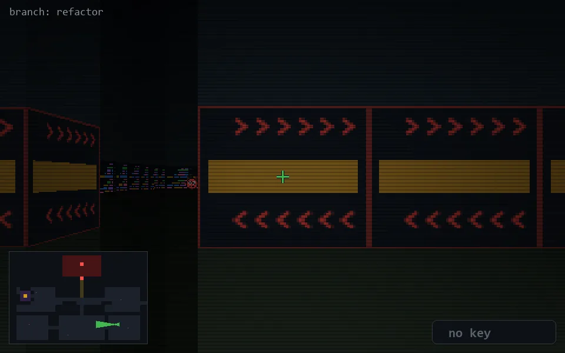

<!-- node:x30y20W -->
### `branch: refactor` · 📍 (30, 20) · facing W · 🔑 —

|      |      |      |
|:----:|:----:|:----:|
|      | [⬆️](x29y20W.md) |      |
| [⬅️](x30y20S.md) | [💥](x30y20W.md) | [➡️](x30y20N.md) |
|      | [⬇️](x31y20W.md) |      |

[⌂ index](../README.md)
