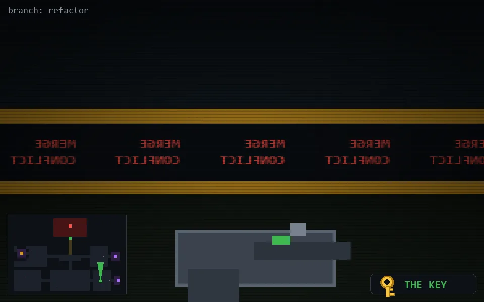

<!-- node:x30y21Nk -->
### `branch: refactor` · 📍 (30, 21) · facing N · 🔑 LGTM

|      |      |      |
|:----:|:----:|:----:|
|      | [⬆️](x30y20Nk.md) |      |
| [⬅️](x30y21Wk.md) | [💥](x30y21Nk.md) | [➡️](x30y21Ek.md) |
|      | [⬇️](x30y22Nk.md) |      |

[⌂ index](../README.md)
