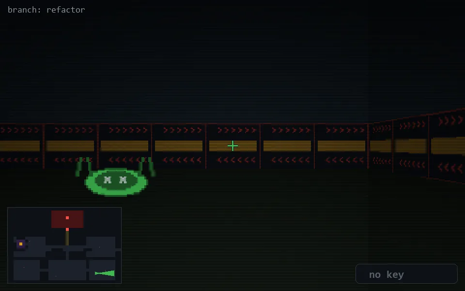

<!-- node:x30y22Ed -->
### `branch: refactor` · 📍 (30, 22) · facing E · 🔑 — · ✖ bug deleted (it will be back)

|      |      |      |
|:----:|:----:|:----:|
|      | [⬆️](x31y22Ed.md) |      |
| [⬅️](x30y22Nd.md) | [💥](x30y22Ed.md) | [➡️](x30y22Sd.md) |
|      | [⬇️](x29y22Ed.md) |      |

[⌂ index](../README.md)
