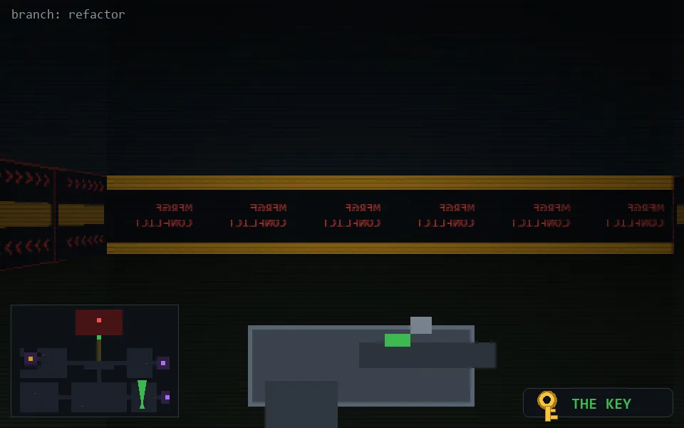

<!-- node:x30y23Nk -->
### `branch: refactor` · 📍 (30, 23) · facing N · 🔑 LGTM

|      |      |      |
|:----:|:----:|:----:|
|      | [⬆️](x30y22Nk.md) |      |
| [⬅️](x30y23Wk.md) | [💥](x30y23Nk.md) | [➡️](x30y23Ek.md) |
|      | [⬇️](x30y24Nk.md) |      |

[⌂ index](../README.md)
