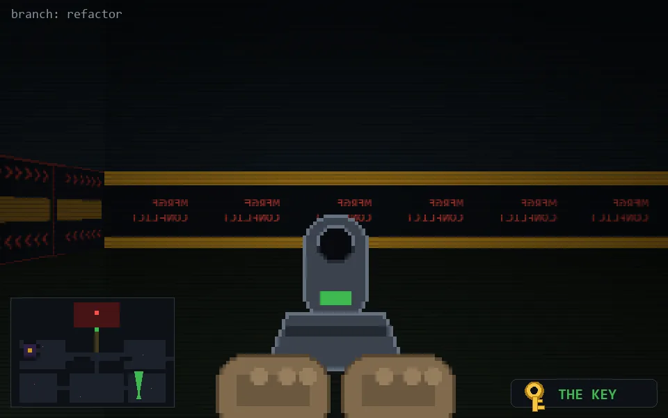

<!-- node:x30y23Nkd -->
### `branch: refactor` · 📍 (30, 23) · facing N · 🔑 THE KEY · ✖ bug deleted (it will be back)

|      |      |      |
|:----:|:----:|:----:|
|      | [⬆️](x30y22Nkd.md) |      |
| [⬅️](x30y23Wkd.md) | [💥](x30y23Nkd.md) | [➡️](x30y23Ekd.md) |
|      | [⬇️](x30y24Nkd.md) |      |

[⌂ index](../README.md)
