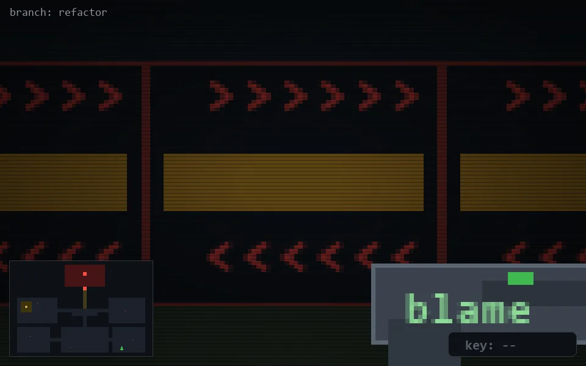

<!-- node:x30y23S -->
### `branch: refactor` · 📍 (30, 23) · facing S · 🔑 —

|      |      |      |
|:----:|:----:|:----:|
|      | [⬆️](x30y24S.md) |      |
| [⬅️](x30y23E.md) | [💥](x30y23Sd.md) | [➡️](x30y23W.md) |
|      | [⬇️](x30y22S.md) |      |

[⌂ index](../README.md)
