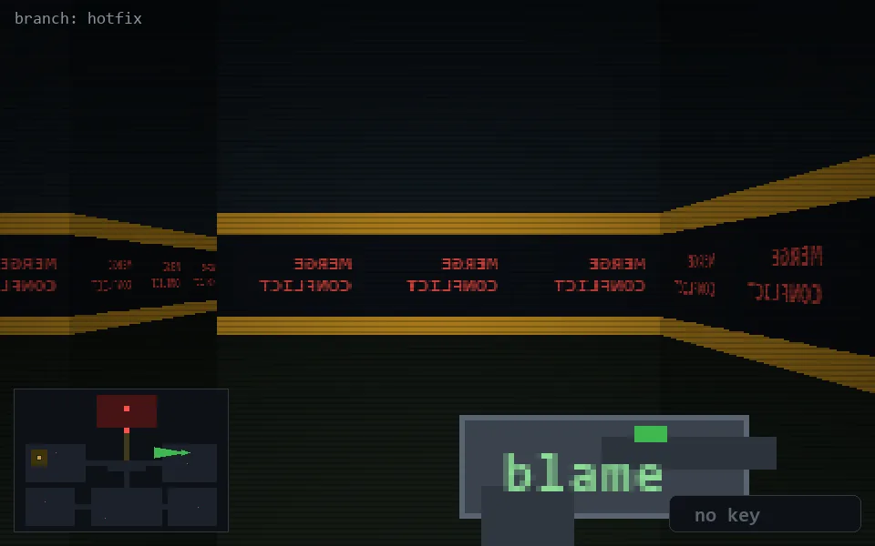

<!-- node:x31y11W -->
### `branch: hotfix` · 📍 (31, 11) · facing W · 🔑 —

|      |      |      |
|:----:|:----:|:----:|
|      | [⬆️](x30y11W.md) |      |
| [⬅️](x31y11S.md) | [💥](x31y11Wd.md) | [➡️](x31y11N.md) |
|      | [⬇️](x32y11W.md) |      |

[⌂ index](../README.md)
