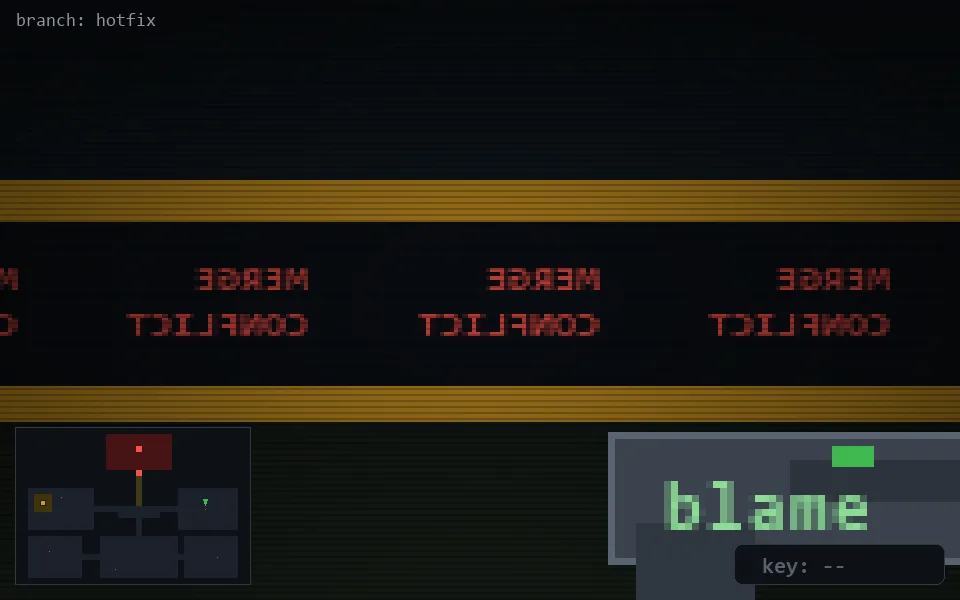

<!-- node:x31y12N -->
### `branch: hotfix` · 📍 (31, 12) · facing N · 🔑 —

|      |      |      |
|:----:|:----:|:----:|
|      | [⬆️](x31y11N.md) |      |
| [⬅️](x31y12W.md) | [💥](x31y12Nd.md) | [➡️](x31y12E.md) |
|      | [⬇️](x31y13N.md) |      |

[⌂ index](../README.md)
