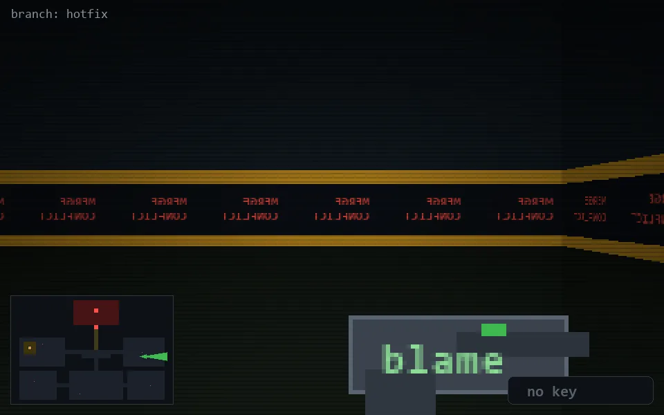

<!-- node:x31y14E -->
### `branch: hotfix` · 📍 (31, 14) · facing E · 🔑 —

|      |      |      |
|:----:|:----:|:----:|
|      | [⬆️](x32y14E.md) |      |
| [⬅️](x31y14N.md) | [💥](x31y14Ed.md) | [➡️](x31y14S.md) |
|      | [⬇️](x30y14E.md) |      |

[⌂ index](../README.md)
