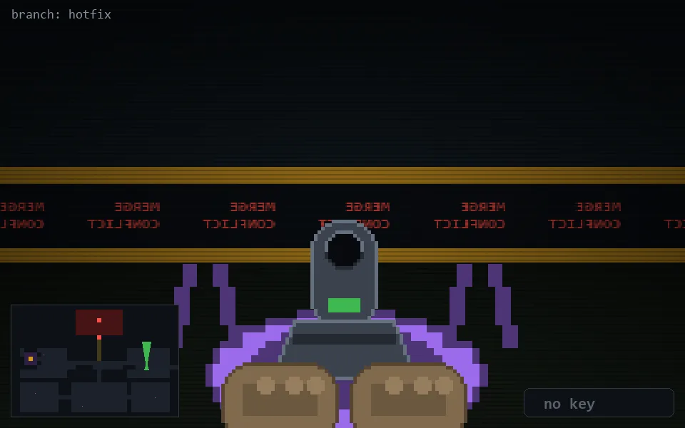

<!-- node:x31y14Nd -->
### `branch: hotfix` · 📍 (31, 14) · facing N · 🔑 — · ✖ bug deleted (it will be back)

|      |      |      |
|:----:|:----:|:----:|
|      | [⬆️](x31y13Nd.md) |      |
| [⬅️](x31y14Wd.md) | [💥](x31y14Nd.md) | [➡️](x31y14Ed.md) |
|      | [⬇️](x31y15Nd.md) |      |

[⌂ index](../README.md)
