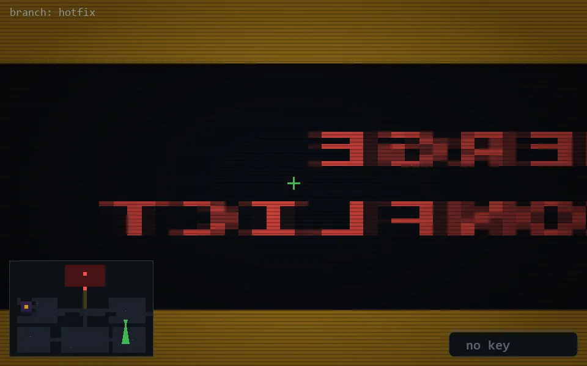

<!-- node:x31y16S -->
### `branch: hotfix` · 📍 (31, 16) · facing S · 🔑 —

|      |      |      |
|:----:|:----:|:----:|
|      | ⛔️ |      |
| [⬅️](x31y16E.md) | [💥](x31y16Sd.md) | [➡️](x31y16W.md) |
|      | [⬇️](x31y15S.md) |      |

[⌂ index](../README.md)
