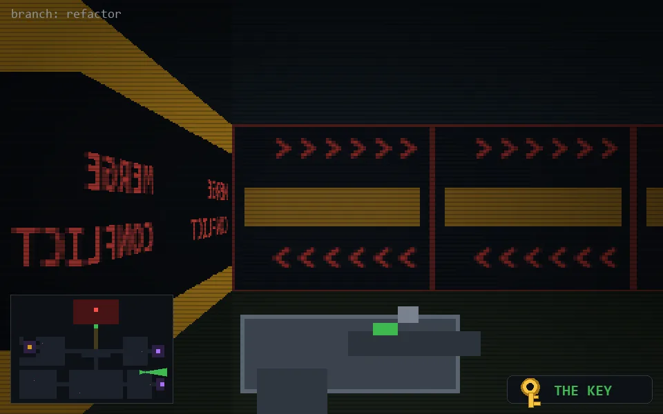

<!-- node:x31y18Ek -->
### `branch: refactor` · 📍 (31, 18) · facing E · 🔑 LGTM

|      |      |      |
|:----:|:----:|:----:|
|      | [⬆️](x32y18Ek.md) |      |
| [⬅️](x31y18Nk.md) | [💥](x31y18Ek.md) | [➡️](x31y18Sk.md) |
|      | [⬇️](x30y18Ek.md) |      |

[⌂ index](../README.md)
