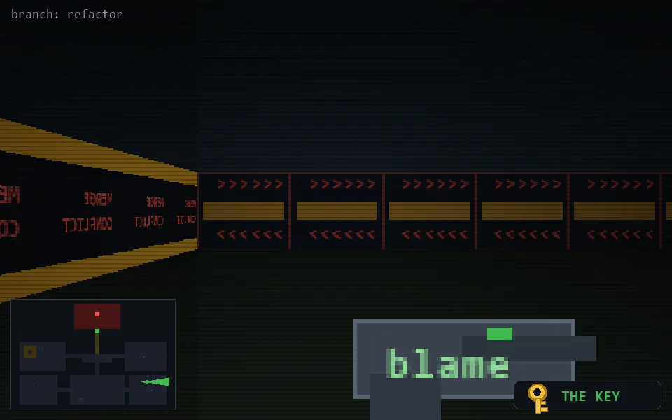

<!-- node:x31y19Ek -->
### `branch: refactor` · 📍 (31, 19) · facing E · 🔑 LGTM

|      |      |      |
|:----:|:----:|:----:|
|      | [⬆️](x32y19Ek.md) |      |
| [⬅️](x31y19Nk.md) | [💥](x31y19Ek.md) | [➡️](x31y19Sk.md) |
|      | [⬇️](x30y19Ek.md) |      |

[⌂ index](../README.md)
