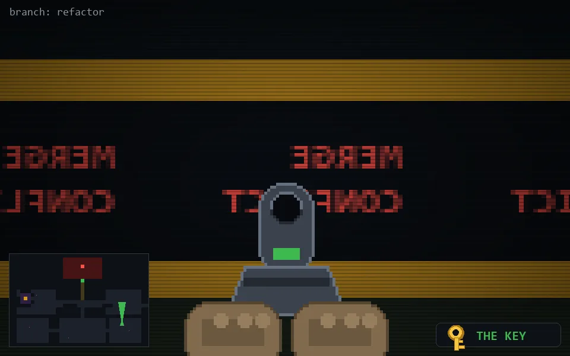

<!-- node:x31y19Nkd -->
### `branch: refactor` · 📍 (31, 19) · facing N · 🔑 THE KEY · ✖ bug deleted (it will be back)

|      |      |      |
|:----:|:----:|:----:|
|      | [⬆️](x31y18Nkd.md) |      |
| [⬅️](x31y19Wkd.md) | [💥](x31y19Nkd.md) | [➡️](x31y19Ekd.md) |
|      | [⬇️](x31y20Nkd.md) |      |

[⌂ index](../README.md)
