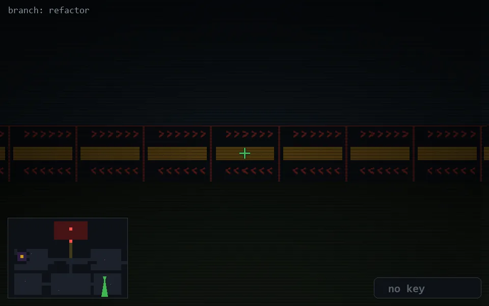

<!-- node:x31y19S -->
### `branch: refactor` · 📍 (31, 19) · facing S · 🔑 —

|      |      |      |
|:----:|:----:|:----:|
|      | [⬆️](x31y20S.md) |      |
| [⬅️](x31y19E.md) | [💥](x31y19S.md) | [➡️](x31y19W.md) |
|      | [⬇️](x31y18S.md) |      |

[⌂ index](../README.md)
