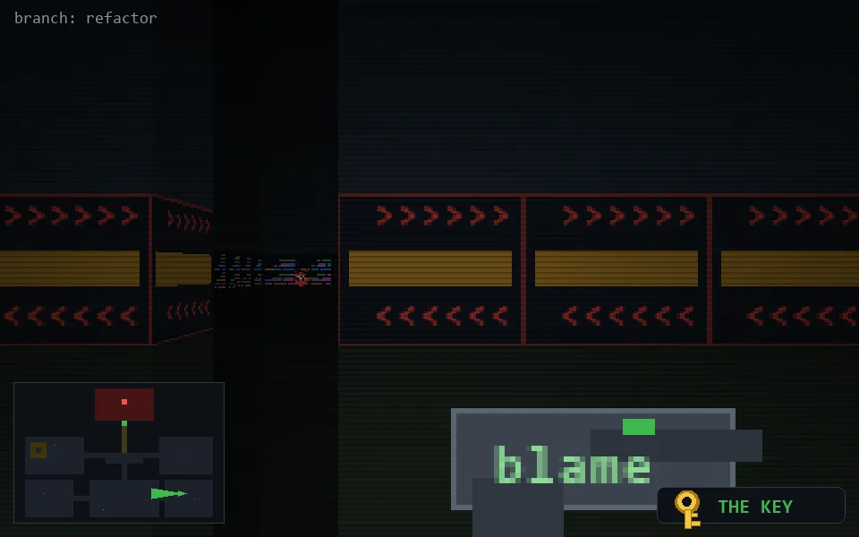

<!-- node:x31y20Wk -->
### `branch: refactor` · 📍 (31, 20) · facing W · 🔑 LGTM

|      |      |      |
|:----:|:----:|:----:|
|      | [⬆️](x30y20Wk.md) |      |
| [⬅️](x31y20Sk.md) | [💥](x31y20Wk.md) | [➡️](x31y20Nk.md) |
|      | [⬇️](x32y20Wk.md) |      |

[⌂ index](../README.md)
