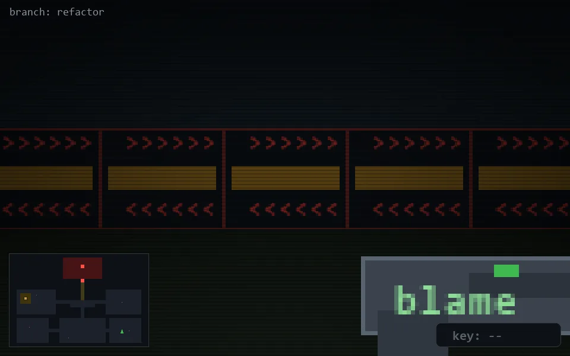

<!-- node:x31y21S -->
### `branch: refactor` · 📍 (31, 21) · facing S · 🔑 —

|      |      |      |
|:----:|:----:|:----:|
|      | [⬆️](x31y22S.md) |      |
| [⬅️](x31y21E.md) | [💥](x31y21Sd.md) | [➡️](x31y21W.md) |
|      | [⬇️](x31y20S.md) |      |

[⌂ index](../README.md)
