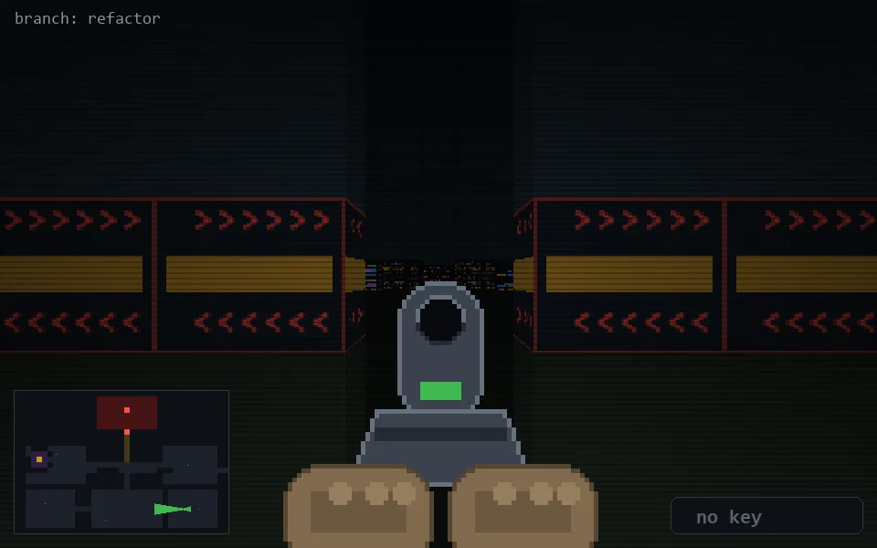

<!-- node:x31y21Wd -->
### `branch: refactor` · 📍 (31, 21) · facing W · 🔑 — · ✖ bug deleted (it will be back)

|      |      |      |
|:----:|:----:|:----:|
|      | [⬆️](x30y21Wd.md) |      |
| [⬅️](x31y21Sd.md) | [💥](x31y21Wd.md) | [➡️](x31y21Nd.md) |
|      | [⬇️](x32y21Wd.md) |      |

[⌂ index](../README.md)
