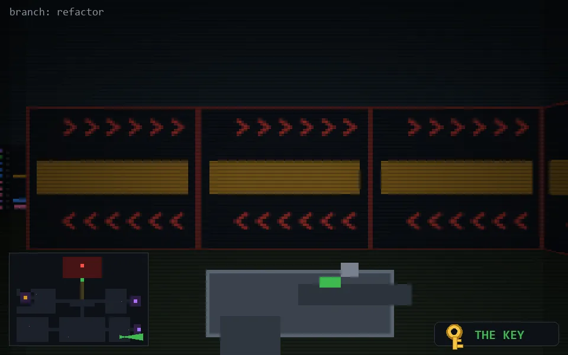

<!-- node:x31y23Ek -->
### `branch: refactor` · 📍 (31, 23) · facing E · 🔑 LGTM

|      |      |      |
|:----:|:----:|:----:|
|      | [⬆️](x32y23Ek.md) |      |
| [⬅️](x31y23Nk.md) | [💥](x31y23Ek.md) | [➡️](x31y23Sk.md) |
|      | [⬇️](x30y23Ek.md) |      |

[⌂ index](../README.md)
