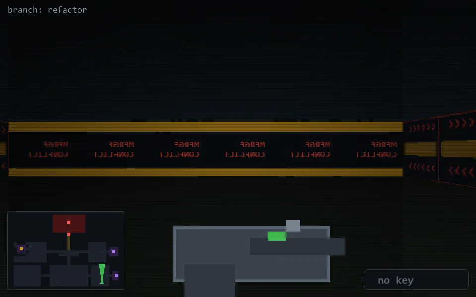

<!-- node:x31y23N -->
### `branch: refactor` · 📍 (31, 23) · facing N · 🔑 —

|      |      |      |
|:----:|:----:|:----:|
|      | [⬆️](x31y22N.md) |      |
| [⬅️](x31y23W.md) | [💥](x31y23N.md) | [➡️](x31y23E.md) |
|      | [⬇️](x31y24N.md) |      |

[⌂ index](../README.md)
