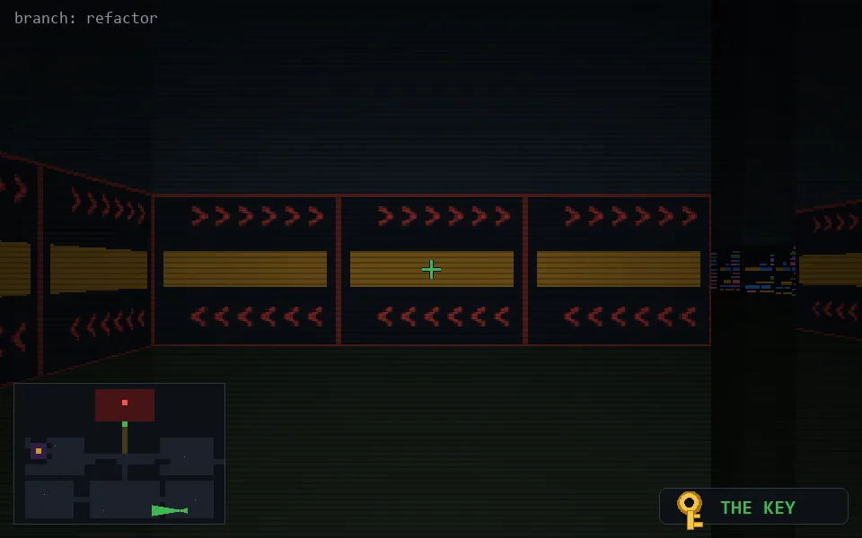

<!-- node:x31y23Wk -->
### `branch: refactor` · 📍 (31, 23) · facing W · 🔑 THE KEY

|      |      |      |
|:----:|:----:|:----:|
|      | [⬆️](x30y23Wk.md) |      |
| [⬅️](x31y23Sk.md) | [💥](x31y23Wk.md) | [➡️](x31y23Nk.md) |
|      | [⬇️](x32y23Wk.md) |      |

[⌂ index](../README.md)
