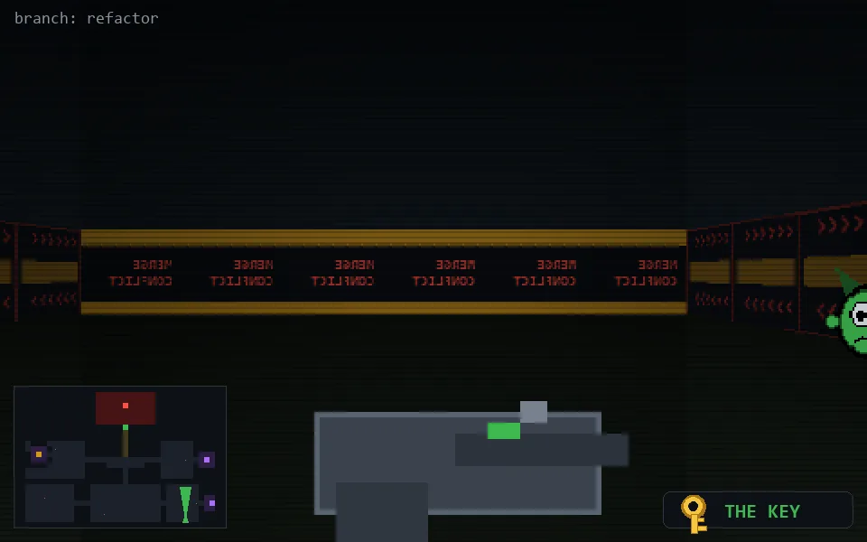

<!-- node:x31y24Nk -->
### `branch: refactor` · 📍 (31, 24) · facing N · 🔑 THE KEY

|      |      |      |
|:----:|:----:|:----:|
|      | [⬆️](x31y23Nk.md) |      |
| [⬅️](x31y24Wk.md) | [💥](x31y24Nkd.md) | [➡️](x31y24Ek.md) |
|      | ⛔️ |      |

[⌂ index](../README.md)
