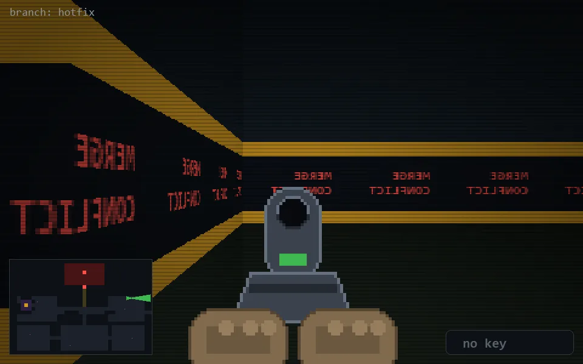

<!-- node:x32y10Ed -->
### `branch: hotfix` · 📍 (32, 10) · facing E · 🔑 — · ✖ bug deleted (it will be back)

|      |      |      |
|:----:|:----:|:----:|
|      | [⬆️](x33y10Ed.md) |      |
| [⬅️](x32y10Nd.md) | [💥](x32y10Ed.md) | [➡️](x32y10Sd.md) |
|      | [⬇️](x31y10Ed.md) |      |

[⌂ index](../README.md)
