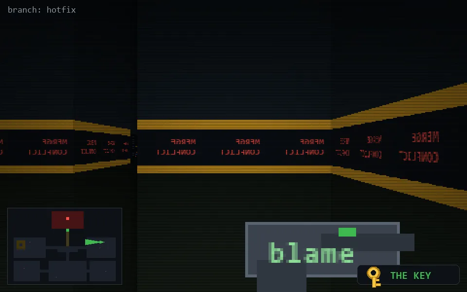

<!-- node:x32y11Wk -->
### `branch: hotfix` · 📍 (32, 11) · facing W · 🔑 LGTM

|      |      |      |
|:----:|:----:|:----:|
|      | [⬆️](x31y11Wk.md) |      |
| [⬅️](x32y11Sk.md) | [💥](x32y11Wk.md) | [➡️](x32y11Nk.md) |
|      | [⬇️](x33y11Wk.md) |      |

[⌂ index](../README.md)
