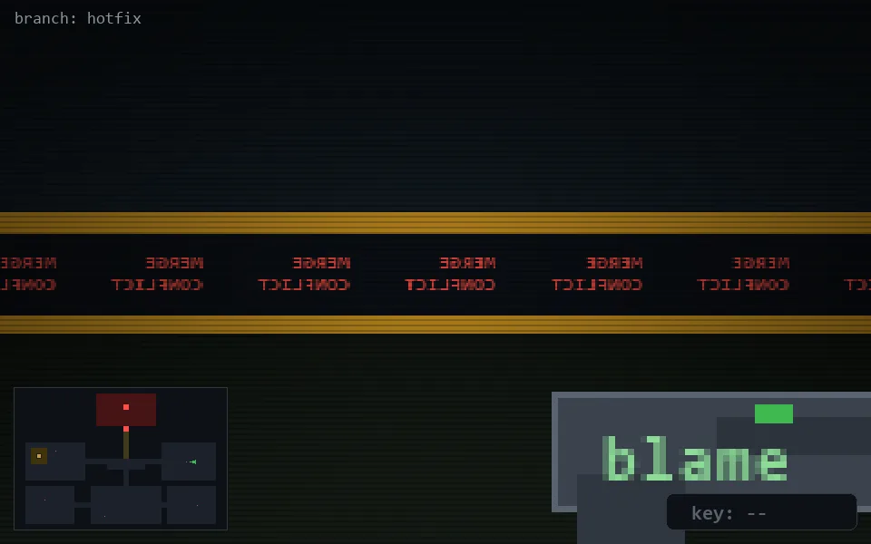

<!-- node:x32y13E -->
### `branch: hotfix` · 📍 (32, 13) · facing E · 🔑 —

|      |      |      |
|:----:|:----:|:----:|
|      | [⬆️](x33y13E.md) |      |
| [⬅️](x32y13N.md) | [💥](x32y13E.md) | [➡️](x32y13S.md) |
|      | [⬇️](x31y13E.md) |      |

[⌂ index](../README.md)
