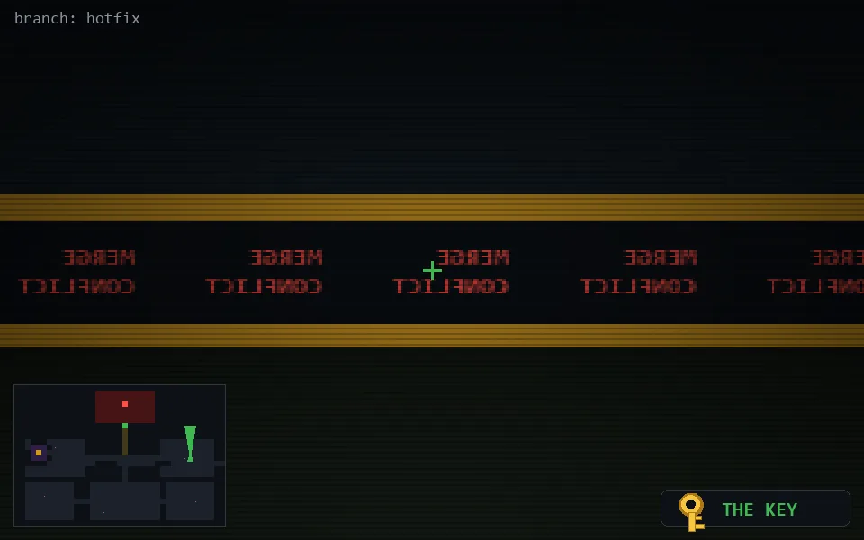

<!-- node:x32y13Nk -->
### `branch: hotfix` · 📍 (32, 13) · facing N · 🔑 LGTM

|      |      |      |
|:----:|:----:|:----:|
|      | [⬆️](x32y12Nk.md) |      |
| [⬅️](x32y13Wk.md) | [💥](x32y13Nk.md) | [➡️](x32y13Ek.md) |
|      | [⬇️](x32y14Nk.md) |      |

[⌂ index](../README.md)
