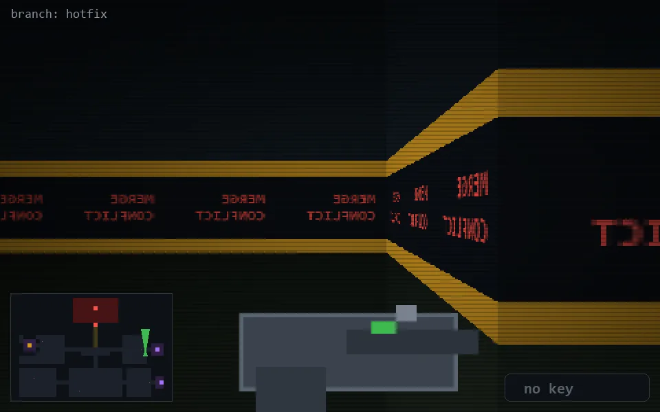

<!-- node:x32y14N -->
### `branch: hotfix` · 📍 (32, 14) · facing N · 🔑 —

|      |      |      |
|:----:|:----:|:----:|
|      | [⬆️](x32y13N.md) |      |
| [⬅️](x32y14W.md) | [💥](x32y14N.md) | [➡️](x32y14E.md) |
|      | [⬇️](x32y15N.md) |      |

[⌂ index](../README.md)
