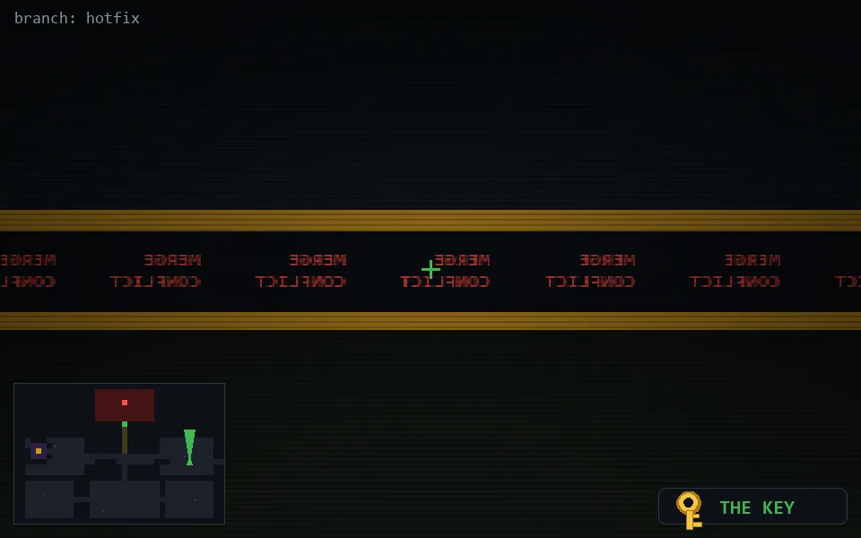

<!-- node:x32y14Nk -->
### `branch: hotfix` · 📍 (32, 14) · facing N · 🔑 THE KEY

|      |      |      |
|:----:|:----:|:----:|
|      | [⬆️](x32y13Nk.md) |      |
| [⬅️](x32y14Wk.md) | [💥](x32y14Nk.md) | [➡️](x32y14Ek.md) |
|      | [⬇️](x32y15Nk.md) |      |

[⌂ index](../README.md)
