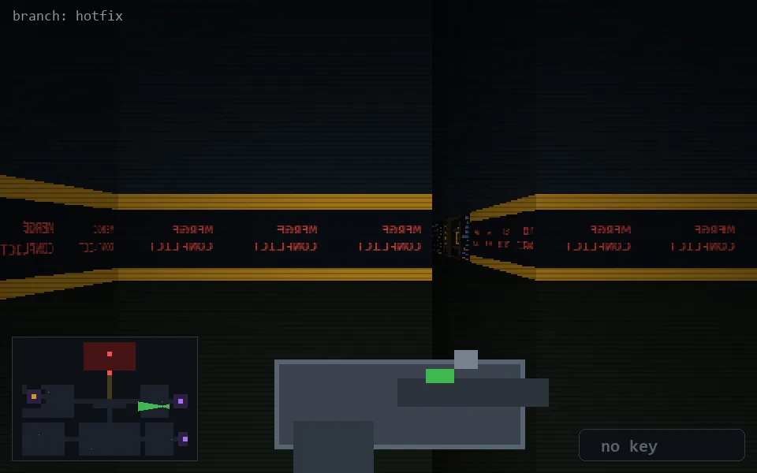

<!-- node:x32y14W -->
### `branch: hotfix` · 📍 (32, 14) · facing W · 🔑 —

|      |      |      |
|:----:|:----:|:----:|
|      | [⬆️](x31y14W.md) |      |
| [⬅️](x32y14S.md) | [💥](x32y14W.md) | [➡️](x32y14N.md) |
|      | ⛔️ |      |

[⌂ index](../README.md)
