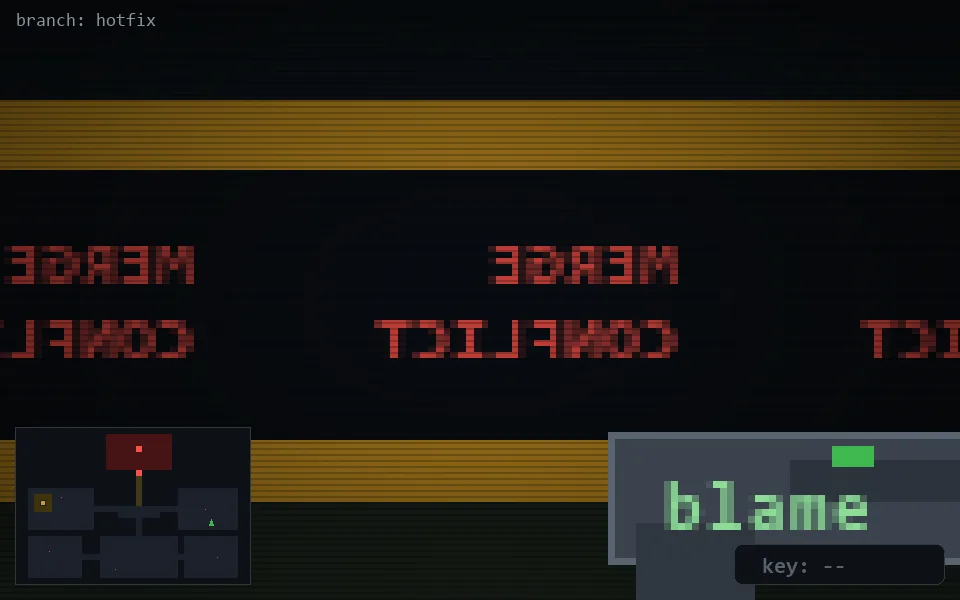

<!-- node:x32y15S -->
### `branch: hotfix` · 📍 (32, 15) · facing S · 🔑 —

|      |      |      |
|:----:|:----:|:----:|
|      | [⬆️](x32y16S.md) |      |
| [⬅️](x32y15E.md) | [💥](x32y15S.md) | [➡️](x32y15W.md) |
|      | [⬇️](x32y14S.md) |      |

[⌂ index](../README.md)
