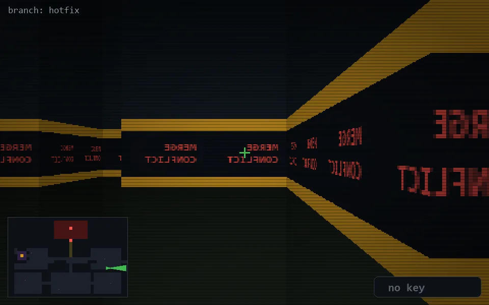

<!-- node:x32y16Ed -->
### `branch: hotfix` · 📍 (32, 16) · facing E · 🔑 — · ✖ bug deleted (it will be back)

|      |      |      |
|:----:|:----:|:----:|
|      | [⬆️](x33y16Ed.md) |      |
| [⬅️](x32y16Nd.md) | [💥](x32y16Ed.md) | [➡️](x32y16Sd.md) |
|      | [⬇️](x31y16Ed.md) |      |

[⌂ index](../README.md)
