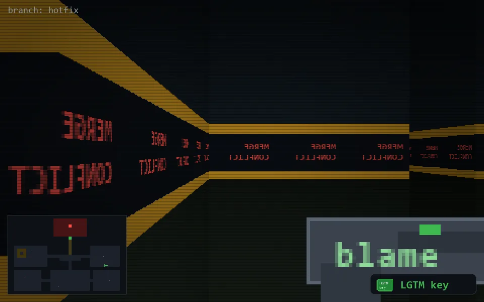

<!-- node:x32y16Wk -->
### `branch: hotfix` · 📍 (32, 16) · facing W · 🔑 THE KEY

|      |      |      |
|:----:|:----:|:----:|
|      | [⬆️](x31y16Wk.md) |      |
| [⬅️](x32y16Sk.md) | [💥](x32y16Wk.md) | [➡️](x32y16Nk.md) |
|      | ⛔️ |      |

[⌂ index](../README.md)
