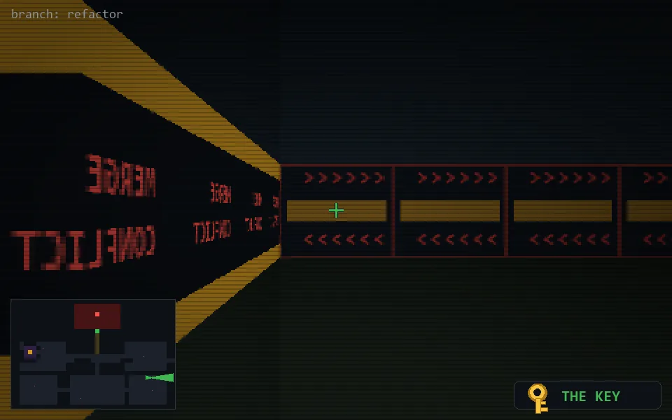

<!-- node:x32y18Ek -->
### `branch: refactor` · 📍 (32, 18) · facing E · 🔑 LGTM

|      |      |      |
|:----:|:----:|:----:|
|      | [⬆️](x33y18Ek.md) |      |
| [⬅️](x32y18Nk.md) | [💥](x32y18Ek.md) | [➡️](x32y18Sk.md) |
|      | [⬇️](x31y18Ek.md) |      |

[⌂ index](../README.md)
