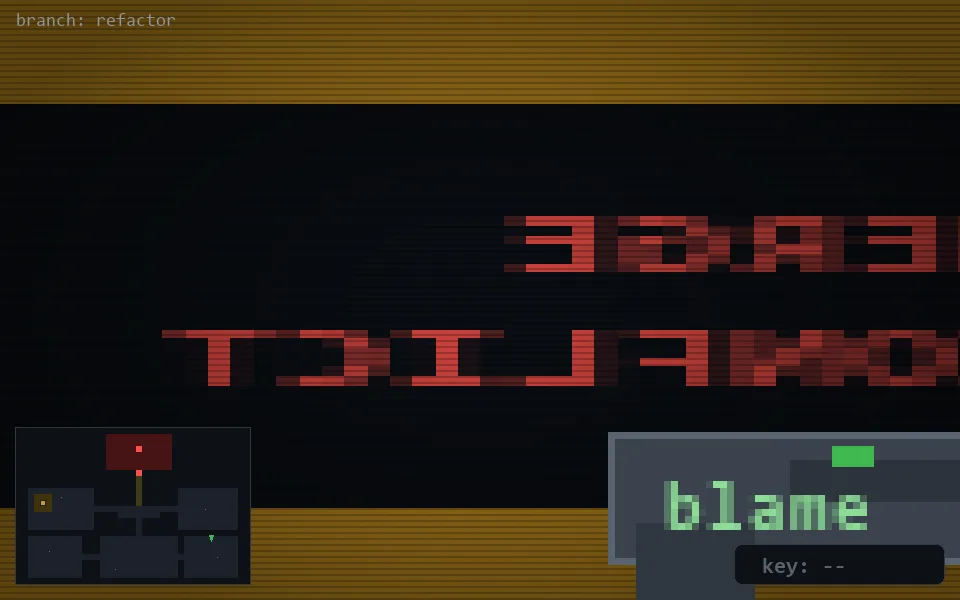

<!-- node:x32y18N -->
### `branch: refactor` · 📍 (32, 18) · facing N · 🔑 —

|      |      |      |
|:----:|:----:|:----:|
|      | ⛔️ |      |
| [⬅️](x32y18W.md) | [💥](x32y18N.md) | [➡️](x32y18E.md) |
|      | [⬇️](x32y19N.md) |      |

[⌂ index](../README.md)
