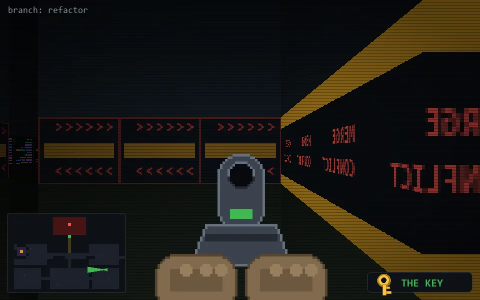

<!-- node:x32y18Wkd -->
### `branch: refactor` · 📍 (32, 18) · facing W · 🔑 THE KEY · ✖ bug deleted (it will be back)

|      |      |      |
|:----:|:----:|:----:|
|      | [⬆️](x31y18Wkd.md) |      |
| [⬅️](x32y18Skd.md) | [💥](x32y18Wkd.md) | [➡️](x32y18Nkd.md) |
|      | [⬇️](x33y18Wkd.md) |      |

[⌂ index](../README.md)
